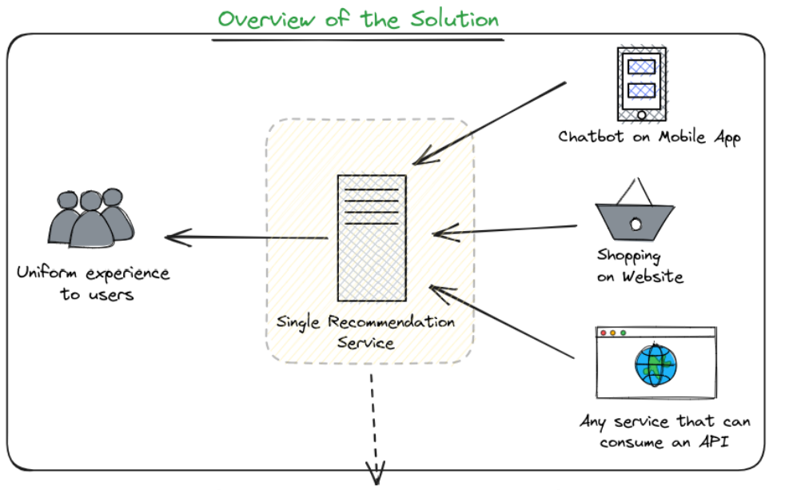
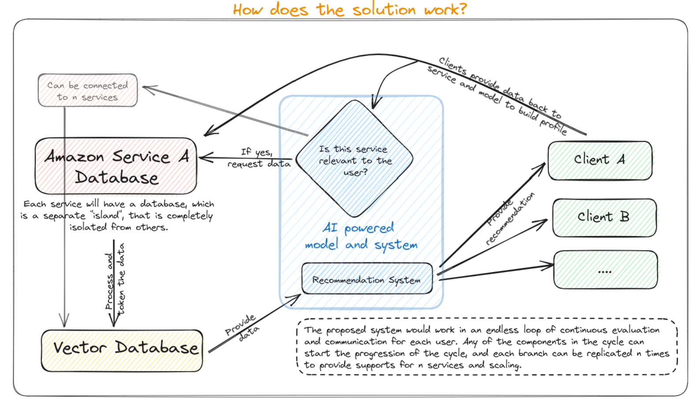

# Amazon HackOn

This is the team `Quadeyes` submission for `Amazon HackOn 2023`.

## Overview of the Proposed Solution

We want to create an AI-powered shopping-cum-virtual assistant that can unite the data provided by all the Amazon services.
The assistant would be realized as an API so that the same can be integrated into multiple forms with all
the existing services: chat-bot, recommendation engine with
platforms like Amazon, Audible, Amazon Music, Prime, etc. This would provide uniformity across all the services and platforms and make the user experience journey decoupled with the client interface, leaving room for expansion.

Here we have mocked the Amazon databases which static databases and history for a particular user `Eshaan`, but the same can be easily explanded to any number of users and sources.

I would highly urge you to checkout our [complete pitch deck](./PitchDeck.pdf) to understand all the componenets of the solution and it's implementation.

## Demonstrations

We have designed two client-side applications to show how the developed solution is independent of the client. Both use the same backend model, `Holo`, which we have trained for the user `Eshaan` based on his searching, movie streaming, and music history. You can see the sample interaction here.

### App

https://github.com/EshaanAgg/hackon/assets/96648934/5f9bfd93-1908-46df-80e6-7dd43f961c8f

### Website

https://github.com/EshaanAgg/hackon/assets/96648934/3d94e1f3-3561-4785-8750-245a63549c47

### How does the demo work?

We are using a thin wrapper on `OpenAI` over the `Holo` model, as the same can only give textual responses or choices. We use `OpenAI` as the NLP processor, which decides which kind of recommendation should be provided to the user. We call the right API of the `Holo` model using `OpenAI functions`. Detailed documentation of the internal models used in `Holo` is included below.

Both the clients call the uniformly developed central backend API, which first communicates with OpenAI functions to figure out the right action/model to call in response to the message, calls the same and then calls OpenAI again to present the user in natural text form to the user. Thus, we can build a client-agnostic solution that works on multiple categories of data and is human-interactable.

## Technologies Used

1. Backend Model - Holo:

   - Built in `Python` using `SKLearn` and `PYTorch`

2. NLP Processor - OpenAI:

   - SDK of `OpenAI` are utilized with `Python` and `Flutter` for this demonstation.

3. Web UI - Python with Chainlit:

   - `Python` with `Chainlit` framework powers the web UI for interactive user interfaces.

4. Mobile App - Flutter:

   - `Flutter` framework for cross-platform Android and iOS app development.

## Holo: ML Documentation

The model makes use of mutiple approaches to form the basis of an `data-agnostic` model, that is a model which can recieve data with any features and kind, and would try to classify and form relationships with the existing data. The same idea is highly inspired by [this OpenSource project](https://github.com/actionml/universal-recommender). This type of `universal recommedation system` fits in the best with out plug-in-any-service you need architecture. The base implementation of the same is taken from [the modAL project](https://github.com/modAL-python/modAL).

### Datasets:

The following datsets have been used to train the model.

- [https://cseweb.ucsd.edu/~jmcauley/datasets/amazon_v2/](https://cseweb.ucsd.edu/~jmcauley/datasets/amazon_v2/)
- [https://grouplens.org/datasets/movielens/25m/](https://grouplens.org/datasets/movielens/25m/)

Other similar datasets can be found [here](https://jmcauley.ucsd.edu/data/amazon/). We would like to utilize the same while training the model for even better performance in the final demonstration.

### Model Training: Similarity-Based Collaborative Filtering

**Approach**

- `User Conversion:` User IDs are converted from objects to integers for ease of handling in the system.
- `Finding Similar Users:` The model calculates the similarity score of the desired user with each other user in the interaction matrix using cosine similarity. The scores are collected in a list and sorted to identify the most similar users. The original user is removed from this list, and the rest are returned as similar users.
- `Recommendation Function:` This function calls the previously mentioned similar user function to find users similar to the desired user. It identifies the products with which the original user has interacted (observed interactions). For each similar user, it finds 'n' products with which the similar user has interacted but not the original user. The specified number of such products is returned as recommendations for the user.

### Prediction using Collaborative Filtering

**Approach**

- `CSR Matrix Conversion:` The matrix of product ratings is converted into a CSR (Compressed Sparse Row) matrix. This compression optimises memory and computational efficiency by storing only non-zero values.
- `Singular Value Decomposition (SVD):` SVD is performed on the CSR matrix to reduce its dimensionality to 50 latent features. This reduction simplifies the complexity of the rating matrix.
  Predicted Ratings Calculation: Predicted ratings for all users are calculated by multiplying the U matrix, the sigma matrix, and the Vt matrix. These predicted ratings are stored in a DataFrame where rows represent users, columns represent products, and values represent predicted ratings.
- `Recommendation Function:` This function uses a user's actual ratings and the predicted ratings from the matrix to create a DataFrame. It identifies products the user has not rated and sorts them by predicted ratings, recommending the top products.
- `Model Evaluation:` Average ratings are calculated for both actual and predicted ratings. A DataFrame is created with average actual and predicted ratings. The Root Mean Square Error (RMSE) is calculated to evaluate the model's accuracy.
